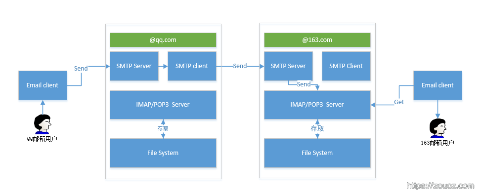
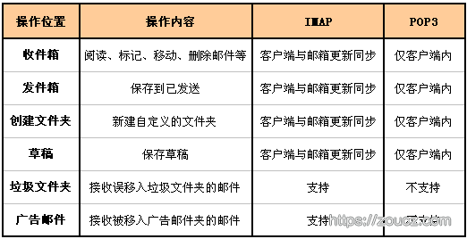
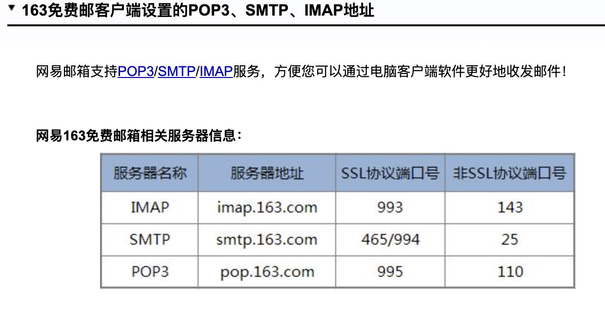

# 理解邮件服务流程——SMTP、IMAP、POP3协议

> 一个QQ邮箱用户编写一封邮件，发送给一个163邮箱用户，后者接收邮件并阅读，这其间都发生了些什么，都有哪些角色，各自发挥什么作用



上图中可以看到5个角色：QQ邮箱用户、QQ邮件服务商、163邮件服务商、163邮件用户、邮件客户端。下面分析下这些角色的内部组成和功能。


## 1. 邮件服务商

邮件服务商需要提供邮件发送、邮件存取两大类服务。


### 1.1 SMTP协议

SMTP协议是一种属于TCP/IP协议族的应用层协议，它使用由TCP提供的可靠的数据传输服务把邮件消息从发信人的邮件服务器传送到收信人的邮件服务器。

如上图所示，邮件服务商实现SMTP协议一般需要分别实现客户端和服务端两个服务，当用户使用SMTP协议将邮件发送给邮件服务商时，用户需要访问SMTP Server，若是QQ邮箱用户发送给QQ邮箱用户，这事儿也就完了，但是当QQ邮箱用户发送给163邮箱用户的时候，咋办呢？ 此时QQ邮箱服务商需要扮演像一个用户一样的SMTP Client的角色，将用户的邮件内容通过SMTP协议发送给163邮件服务商的SMTP Server。

上图中可以看到，QQ邮箱用户发送邮件的时候，邮件是发给SMTP Server了的。

### 1.2 IMAP/POP3协议

上一小节提到的SMTP协议负责邮件的发送，那么邮件存取方面的业务咋搞呢？此时就要用到IMAP/POP3协议，这两个协议定义了用户像服务商查询、分组、移动、编辑等方面的操作规范。

因此，邮件服务商还需要实现一个IMAP协议的服务器，或者POP3协议的服务器，或者IMAP+POP3。

IMAP和POP3有啥区别呢？POP3是比较老的协议，而IMAP稍微新一点(距离现在也很久了…)。 他们之间的区别摘录163邮箱帮助文档中的一段说明。


### 1.3 IMAP与POP3的区别

POP3协议允许电子邮件客户端下载服务器上的邮件，但是在客户端的操作（如移动邮件、标记已读等），不会反馈到服务器上，比如通过客户端收取了邮箱中的3封邮件并移动到其他文件夹，邮箱服务器上的这些邮件是没有同时被移动的 。

而IMAP提供webmail 与电子邮件客户端之间的双向通信，客户端的操作都会反馈到服务器上，对邮件进行的操作，服务器上的邮件也会做相应的动作。

同时，IMAP像POP3那样提供了方便的邮件下载服务，让用户能进行离线阅读。IMAP提供的摘要浏览功能可以让你在阅读完所有的邮件到达时间、主题、发件人、大小等信息后才作出是否下载的决定。此外，IMAP 更好地支持了从多个不同设备中随时访问新邮件。

上图中可以看到163邮箱用户读取邮件时，是向163服务商的IMAP/POP3 Server读取的。



总之，IMAP 整体上为用户带来更为便捷和可靠的体验。POP3 更易丢失邮件或多次下载相同的邮件，但 IMAP 通过邮件客户端与webmail 之间的双向同步功能很好地避免了这些问题。


## 2. 邮件客户端

根据上面对邮件服务商各个协议实现的理解，那么邮件客户端要做的工作就一目了然了：

* 实现SMTP客户端，发送邮件
* 实现IMAP与POP3协议，存取、管理邮件内容
* 邮件客户端提供的其他高级功能

这里只是简单列举了一下邮件客户端基本的功能原理，实际上现在的邮件客户端功能都非常繁多和复杂，常用的邮件客户端有Outlook、Firefox等，现在手机上也有非常多的邮件客户端，它们都需要实现上面列举的基本功能~

## 3. 使用163提供的SMTP协议接口发送邮件

邮件服务商实现的SMTP、IMAP、POP3服务都需要向外部提供协议接口，以供邮件客户端使用。


在163邮箱帮助文档里边可以看到服务的相关信息：




nodejs开源模块nodemailer可用于开发邮件SMTP客户端，代码如下：

```
const nodeMailer=require('nodemailer');

let smtpConfig = {
    host: 'smtp.163.com',
    port: 25,
    secure: false,
    auth: {
        user: 'zouchengzhuo@163.com',
        pass: 'your password'
    }
};
let transporter = nodeMailer.createTransport(smtpConfig);
var mailOptions ={
    from:'zoucz<zouchengzhuo@163.com>',
    to:'zoucz<405966530@qq.com>',
    subject:'测试SMTP发送邮件',
    text: 'email text content',
    html: '<h1>Hello SMTP protocol</h1>'
};
transporter.sendMail(mailOptions,function(error, info){
    if(error){
        return console.log(error);
    }
    console.log('Message sent: '+ info.response);
});

```


https://www.zoucz.com/blog/2017/02/07/email-service/

